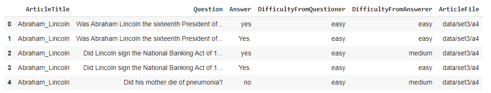
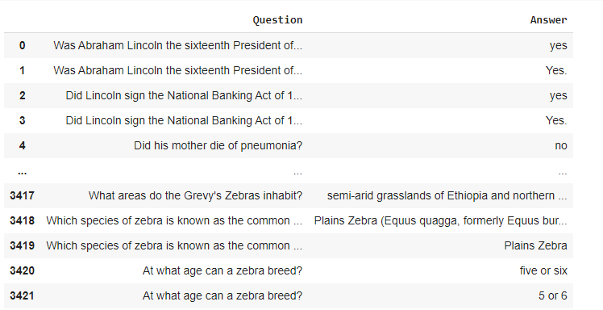
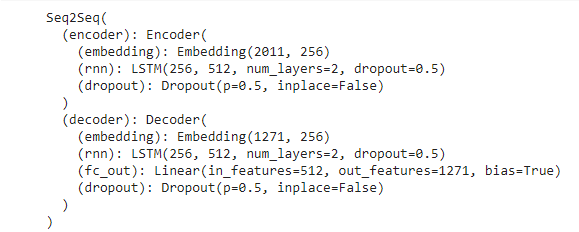
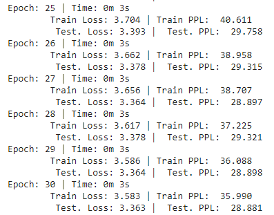
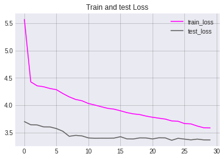
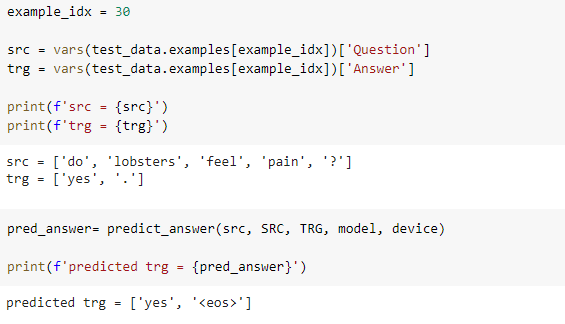
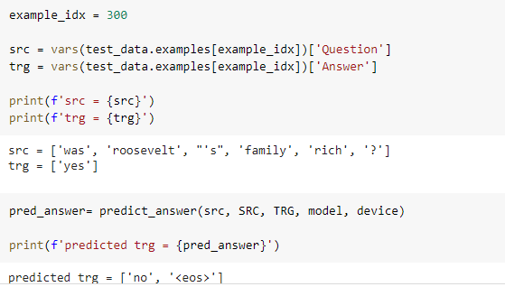

## Introduction

Here we will be building a sequence to sequence deep learning model using `PyTorch` and `TorchText` for prediction of answers for given questions. Sequence to Sequence (seq2seq) model here uses an encoder-decoder architecture. Encoder neural network encodes the input sequence(question) into a single vector, also called as a Context Vector,which is an abstract representation of the input sequence. This vector is then passed into the decoder neural network, which is used to output the corresponding output sequence (answer), one word at a time.

## Dataset

We use Question/Answer dataset  generated by students who took undergraduate natural language processing courses taught by Noah Smith at Carnegie Mellon and Rebecca Hwa at the University of Pittsburgh during Spring 2008, Spring 2009, and Spring 2010.

There are three files, one for each year of students: S08, S09, and S10.

The file `question_answer_pairs.txt` contains the questions and answers. The first line of the file contains 
column names for the tab-separated data fields in the file. Raw data looks like following

- Field 1 is the name of the Wikipedia article from which questions and answers initially came.
- Field 2 is the question.
- Field 3 is the answer.
- Field 4 is the prescribed difficulty rating for the question as given to the question-writer. 
- Field 5 is a difficulty rating assigned by the individual who evaluated and answered the question, 
  which may differ from the difficulty in field 4.
- Field 6 is the relative path to the prefix of the article files. html files (.htm) and cleaned 
  text (.txt) files are provided.

We merge all three files and create our final dataset.

After preprocessing final train dataset look like following

We have 3420 total question-answer pairs ,which we randomly split further into train and test set in 70:30 ratio. Finally we have 2395 train samples and 1027 test samples

### Model

Sequence to Sequence (seq2seq) model here uses an encoder-decoder architecture. Encoder neural network encodes the input sequence(question) into a single vector, also called as a Context Vector,which is an abstract representation of the input sequence. This vector is then passed into the decoder neural network, which is used to output the corresponding output sequence (answer), one word at a time. Model  and parameters are as follows :

Parameters:

- Encoder Embedding_dim = 256

- Decoder Embedding_dim = 256

- Hidden_nodes = 512

- Output_nodes = 5

- Number of layers = 2

- Encoder Dropout = 0.5

- Decoder Dropout= 0.5

  

Optimizer:  `Adam` adapts the learning rate for each parameter, giving parameters that are updated more frequently lower learning rates and parameters that are updated infrequently higher learning rates.

Loss function : `CrossEntropyLoss`

Learning rate : 2e-4

Epochs :30

### Results

###### Train and test logs

###### Train and test loss 

|       | Loss | Perplexity |
| ----- | ---- | ---------- |
| Train | 3.5  | 35.9       |
| Test  | 3.3  | 28.88      |

###### Predictions

